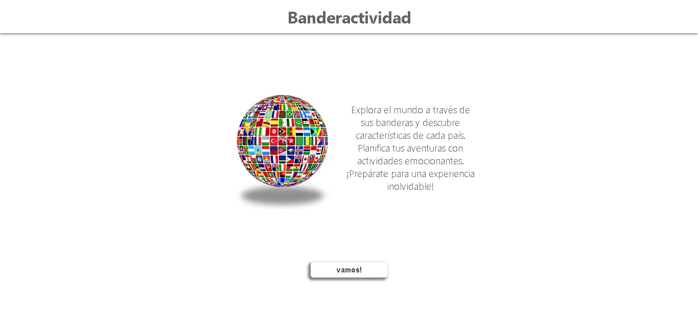
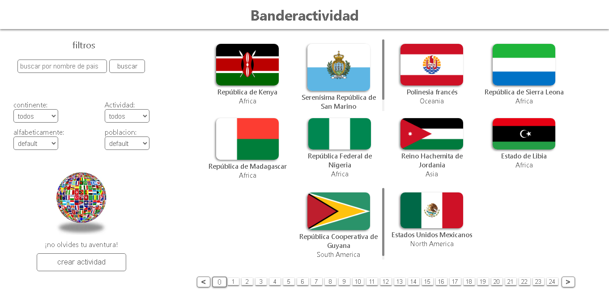
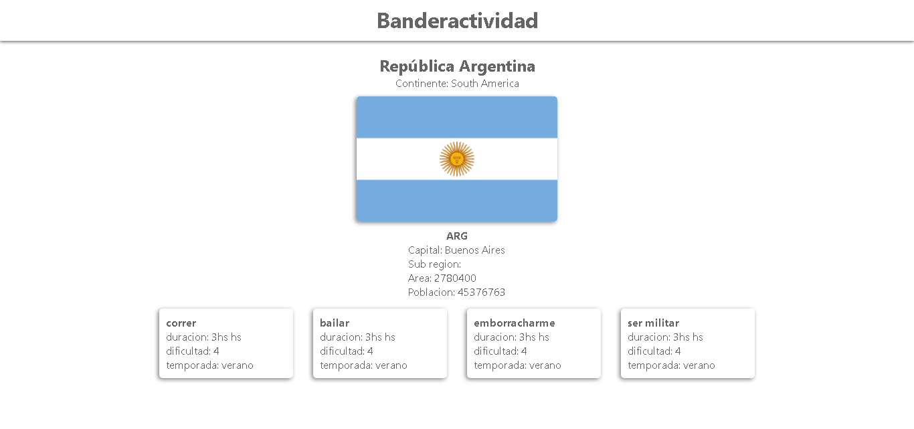
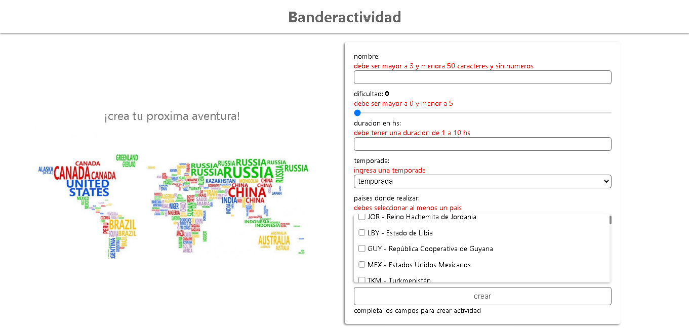
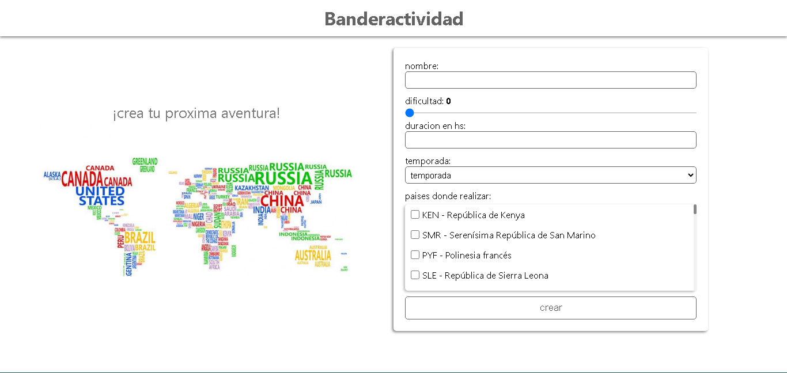

# Banderactividad

Proyecto web donde se puede visualizar banderas de paises, ver características y poder crear actividad para aventurar y poder contar dicha anécdota.

## Backend del proyecto:
 [https://github.com/Davidvg29/countries-backend](https://github.com/Davidvg29/countries-backend)

## Tecnologias cliente
- React
- React-Router
- Redux
- Axios
- Vite

